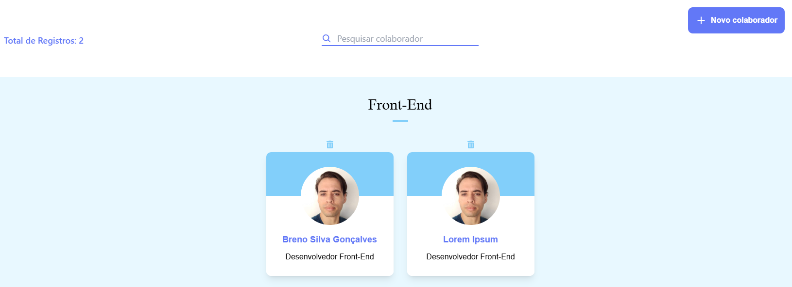

# Organo - cadastro de colaboradores em times diferentes (em andamento)
## Link da aplicação: https://frolicking-concha-8a62eb.netlify.app/

## Descrição
- Aplicação React de cadastro de colaboradores em diferentes times de tecnologia no formato de organograma;
- Através da aplicação é possivel cadastrar, listar e remover colaboradores.
## Tecnologias utilizadas
- React.JS: criação e reutilização de componentes e utilização do hook useState;
- React Icons: pacote de ícones;
- Tailwind CSS: utilização de classes utilitárias e personalização de tema com variáveis;
- Vite: ferramenta de build e servidor de desenvolvimento;
- ESLint e Prettier: formatação e estilo de código;
## Como rodar a aplicação
- Clone o repositório localmente;
- Em seguida, entre na pasta mais interna chamada organo e execute os seguintes comandos: npm install (para instalar as dependências gerais da aplicação) e depois npm install -D tailwindcss postcss autoprefixer (para instalar as dependências do Tailwind CSS);
- Depois, execute o comando npm run dev que irá rodar o servidor da aplicação possivelmente na porta 5173 do seu navegador web;   
## Licença
Este código está licenciado usando a [licença-MIT](./LICENSE).
